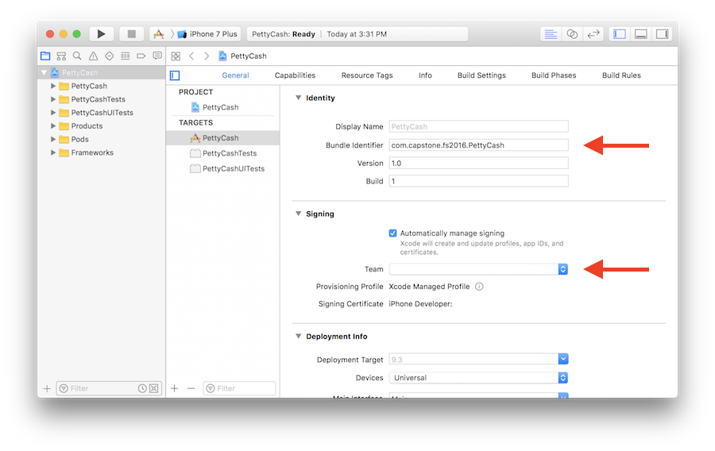

# PettyCash-iOS

## Description
PettyCash was the product of my senior capstone project for my undergraduate degree. PettyCash aids users in forming better savings habits by gamifying savings. This is done by setting short term, achievable financial goals and then contributing to those goals in seemingly trivial ways on a daily basis. 

We say trivial because rather than going through all the steps of signing in to your account and setting up the transfer manually, PettyCash aims to simplify this process and make it fun. Small deposits are placed into your savings account by taking care of your virtual pet - feeding, bathing, grooming, praising with treats, and of course poop scooping. 

Moreover, users are able to track their expenses within PettyCash and get a visual breakdown of what categories their money is going to.

## Running PettyCash
Because PettyCash uses CloudKit extensively, running this project requires a paid Apple Developer account. To run this project,  please change the bundle identifier, ensure you are developer account is selected in the Signing section, and CloudKit is enabled in Capabilities.

Full documentation and the final keynote presentation are located within the project folder. Sorry about the Keynote file but I figured if you're able to run this project in Xcode then you're able to open a Keynote file.
